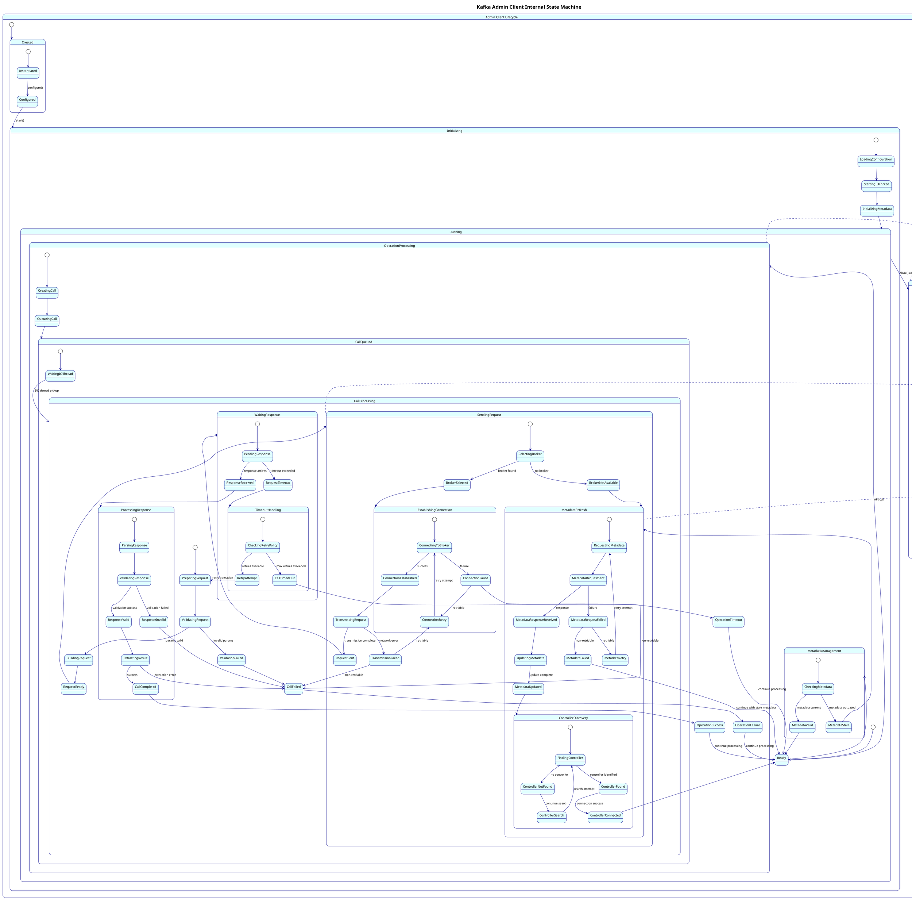

# Apache Kafka Admin Client Internal Design Analysis

## Table of Contents
1. [Admin Client Source Code Review](#admin-client-source-code-review)
2. [Admin Client Test Analysis](#admin-client-test-analysis)
3. [Internal Architecture Components](#internal-architecture-components)
4. [Detailed State Machine Analysis](#detailed-state-machine-analysis)
5. [PlantUML State Machine Diagram](#plantuml-state-machine-diagram)

## Admin Client Source Code Review

### Overview
The Apache Kafka admin client source code at `https://github.com/jabrena/kafka/tree/21ab4d2c6d821c7d90f4ead06d2f9e461654cd0e/clients/src/main/java/org/apache/kafka/clients/admin` contains the implementation for programmatically managing Kafka clusters.

### Key Source Files and Components

#### 1. KafkaAdminClient.java
- **Main admin API implementation**
- Thread-safe administrative operations
- Asynchronous request/response handling
- Resource lifecycle management

#### 2. AdminClient.java (Interface)
- **Public API interface**
- Defines all administrative operations
- Topic, partition, and configuration management
- Consumer group and ACL operations

#### 3. AdminClientConfig.java
- **Configuration management**
- Client configuration properties
- Validation and default values
- Security and connection settings

#### 4. AdminClientRunnable.java
- **Background thread for I/O operations**
- Request scheduling and execution
- Network communication coordination
- Response processing and callback handling

#### 5. Call.java (Abstract base)
- **Request/response abstraction**
- Encapsulates admin operation lifecycle
- Handles timeouts and retries
- Manages operation state transitions

#### 6. CallInFlight.java
- **In-flight request tracking**
- Manages pending requests
- Correlation ID mapping
- Response routing and completion

#### 7. AdminMetadataManager.java
- **Cluster metadata management**
- Broker discovery and updates
- Controller identification
- Metadata refresh coordination

#### 8. AdminClientUtils.java
- **Utility functions**
- Request building helpers
- Response parsing utilities
- Common validation logic

### Specialized Call Implementations

#### Topic Management Calls
- **CreateTopicsCall**: Topic creation with validation
- **DeleteTopicsCall**: Topic deletion handling
- **ListTopicsCall**: Topic listing and filtering
- **DescribeTopicsCall**: Topic metadata retrieval

#### Configuration Management Calls
- **DescribeConfigsCall**: Configuration retrieval
- **AlterConfigsCall**: Configuration updates
- **IncrementalAlterConfigsCall**: Incremental config changes

#### Consumer Group Management Calls
- **ListConsumerGroupsCall**: Group discovery
- **DescribeConsumerGroupsCall**: Group state information
- **DeleteConsumerGroupsCall**: Group deletion

#### ACL Management Calls
- **CreateAclsCall**: Access control creation
- **DeleteAclsCall**: ACL deletion
- **DescribeAclsCall**: ACL listing and filtering

## Admin Client Test Analysis

### Test Structure and Patterns

#### Unit Tests
- **MockAdminClient Usage**: Testing without Kafka cluster
- **Call Implementation Tests**: Individual operation testing
- **Configuration Validation Tests**: Parameter validation
- **Error Handling Tests**: Failure scenario coverage

#### Integration Tests
- **Cluster Operations**: Real cluster interaction
- **End-to-End Workflows**: Complete operation cycles
- **Concurrent Operation Tests**: Multi-threaded scenarios
- **Performance Tests**: Operation latency and throughput

#### Key Test Categories

1. **Topic Management Tests**
   ```java
   // Example test pattern
   AdminClient adminClient = AdminClient.create(configs);
   CreateTopicsResult result = adminClient.createTopics(
       Collections.singleton(new NewTopic("test-topic", 3, (short) 1))
   );
   result.all().get(30, TimeUnit.SECONDS);
   ```

2. **Configuration Management Tests**
   - Dynamic configuration updates
   - Configuration validation
   - Broker and topic-level configs

3. **Consumer Group Tests**
   - Group state monitoring
   - Offset management
   - Group deletion scenarios

4. **Error Handling Tests**
   - Network failure scenarios
   - Authorization errors
   - Timeout handling

## Internal Architecture Components

### Core Component Architecture

```
KafkaAdminClient
    ├── AdminClientRunnable (I/O thread)
    ├── AdminMetadataManager (metadata)
    ├── NetworkClient (network layer)
    ├── Call implementations (operations)
    ├── CallInFlight (request tracking)
    └── AdminClientConfig (configuration)
```

### Component Responsibilities

#### KafkaAdminClient
- **Public API Implementation**: Implements AdminClient interface
- **Request Coordination**: Manages operation lifecycle
- **Resource Management**: Handles client lifecycle
- **Thread Safety**: Ensures thread-safe operations

#### AdminClientRunnable
- **Background I/O Thread**: Handles network operations
- **Request Processing**: Executes queued operations
- **Response Handling**: Processes broker responses
- **Event Loop**: Drives network communication

#### AdminMetadataManager
- **Cluster Metadata**: Maintains broker information
- **Controller Discovery**: Identifies cluster controller
- **Metadata Refresh**: Updates cluster topology
- **Node Management**: Tracks available brokers

#### Call (Abstract Base Class)
- **Operation Abstraction**: Encapsulates admin operations
- **State Management**: Tracks operation lifecycle
- **Retry Logic**: Handles operation retries
- **Completion Handling**: Manages success/failure callbacks

#### CallInFlight
- **Request Tracking**: Maps correlation IDs to calls
- **Response Routing**: Delivers responses to correct calls
- **Timeout Management**: Handles request timeouts
- **Completion Signaling**: Notifies operation completion

### Threading Model

#### Dual-Thread Design
- **Main Thread**: API calls and result handling
- **I/O Thread**: Network communication (AdminClientRunnable)
- **Thread Communication**: Queue-based message passing

#### Request Flow
1. **API Call**: Main thread creates Call object
2. **Queuing**: Call added to pending queue
3. **Processing**: I/O thread processes queue
4. **Network**: Request sent to appropriate broker
5. **Response**: I/O thread receives and routes response
6. **Completion**: Result delivered to main thread

## Detailed State Machine Analysis

### Admin Client Lifecycle States

#### 1. Initialization States
- **CREATED**: AdminClient instantiated but not started
- **INITIALIZING**: Loading configuration and starting components
- **RUNNING**: Fully operational and accepting requests

#### 2. Request Processing States
- **QUEUED**: Operation queued for processing
- **PREPARING**: Building network request
- **SENT**: Request sent to broker
- **PENDING**: Awaiting broker response
- **COMPLETING**: Processing response

#### 3. Metadata Management States
- **METADATA_UNKNOWN**: No cluster metadata available
- **METADATA_UPDATING**: Refreshing cluster information
- **METADATA_AVAILABLE**: Current metadata ready
- **CONTROLLER_UNKNOWN**: Cluster controller not identified
- **CONTROLLER_KNOWN**: Controller broker identified

#### 4. Network States
- **CONNECTING**: Establishing broker connections
- **CONNECTED**: Active connection to broker
- **DISCONNECTED**: Connection lost or closed
- **RECONNECTING**: Attempting to restore connection

#### 5. Operation States
- **OPERATION_PENDING**: Operation awaiting execution
- **OPERATION_IN_FLIGHT**: Request sent, response pending
- **OPERATION_COMPLETED**: Operation successful
- **OPERATION_FAILED**: Operation failed with error
- **OPERATION_TIMED_OUT**: Operation exceeded timeout

#### 6. Error and Recovery States
- **RETRIABLE_ERROR**: Temporary failure, can retry
- **NON_RETRIABLE_ERROR**: Permanent failure
- **RETRYING**: Attempting operation retry
- **BACKOFF_WAIT**: Waiting before retry attempt

#### 7. Shutdown States
- **CLOSING**: Shutdown initiated
- **DRAINING**: Completing pending operations
- **CLOSED**: Fully shut down and cleaned up

### State Transition Triggers

#### External Triggers
- **API Method Calls**: Trigger operation creation
- **close()**: Initiates shutdown sequence
- **Configuration Updates**: May trigger reconnections

#### Internal Triggers
- **Network Events**: Connection state changes
- **Metadata Updates**: Cluster topology changes
- **Timer Events**: Timeouts and periodic tasks
- **Response Reception**: Broker response processing

#### Error Triggers
- **Network Failures**: Connection issues
- **Broker Errors**: Server-side failures
- **Timeout Expiration**: Operation timeouts
- **Authentication Failures**: Security errors

### Call State Transitions

Each administrative operation follows a detailed state machine:

#### Call Lifecycle
1. **CREATED**: Call object instantiated
2. **QUEUED**: Added to processing queue
3. **PREPARING**: Building network request
4. **READY_TO_SEND**: Request ready for transmission
5. **SENT**: Request transmitted to broker
6. **PENDING_RESPONSE**: Awaiting broker response
7. **RESPONSE_RECEIVED**: Response received from broker
8. **PROCESSING_RESPONSE**: Parsing and validating response
9. **COMPLETED/FAILED**: Final state with result

#### Error Handling in Calls
- **RETRIABLE_FAILURE**: Can be retried with backoff
- **NON_RETRIABLE_FAILURE**: Permanent failure
- **TIMEOUT**: Operation exceeded time limit
- **CANCELLED**: Operation cancelled by client

### Metadata State Management

#### Metadata Refresh Cycle
1. **METADATA_NEEDED**: Metadata refresh required
2. **METADATA_REQUEST_SENT**: Metadata request to broker
3. **METADATA_RESPONSE_RECEIVED**: Metadata response processing
4. **METADATA_UPDATED**: Cluster information refreshed
5. **CONTROLLER_DISCOVERY**: Identifying cluster controller

#### Controller Management
- **CONTROLLER_SEARCH**: Looking for controller broker
- **CONTROLLER_FOUND**: Controller identified and connected
- **CONTROLLER_LOST**: Controller connection failed
- **CONTROLLER_CHANGED**: New controller elected

## PlantUML State Machine Diagram

### Comprehensive Admin Client State Machine

The following diagram represents the complete state machine for the Kafka Admin Client, including all major states, sub-states, and transitions:



### State Machine Key Features

#### Hierarchical State Organization
- **Nested States**: Complex states contain detailed sub-states
- **State Composition**: Multiple concurrent state machines
- **State Inheritance**: Common behaviors in parent states

#### Comprehensive Error Handling
- **Error Categorization**: Retriable vs non-retriable errors
- **Retry Mechanisms**: Exponential backoff with jitter
- **Timeout Management**: Operation and connection timeouts
- **Fallback Strategies**: Graceful degradation patterns

#### Resource Management
- **Connection Pooling**: Efficient broker connection management
- **Memory Management**: Bounded queues and resource limits
- **Cleanup Procedures**: Proper resource release on shutdown

#### Concurrency Control
- **Thread Safety**: Safe interaction between main and I/O threads
- **Queue Management**: Pending operation queuing
- **Synchronization**: Proper coordination between threads

#### Metadata Coordination
- **Cluster Discovery**: Automatic broker and controller discovery
- **Metadata Refresh**: Periodic and event-driven updates
- **Controller Tracking**: Specialized controller connection management

This comprehensive state machine provides complete visibility into the Kafka Admin Client's internal operation, showing how it manages cluster metadata, processes administrative operations, handles network communication, and ensures reliable operation in distributed environments.