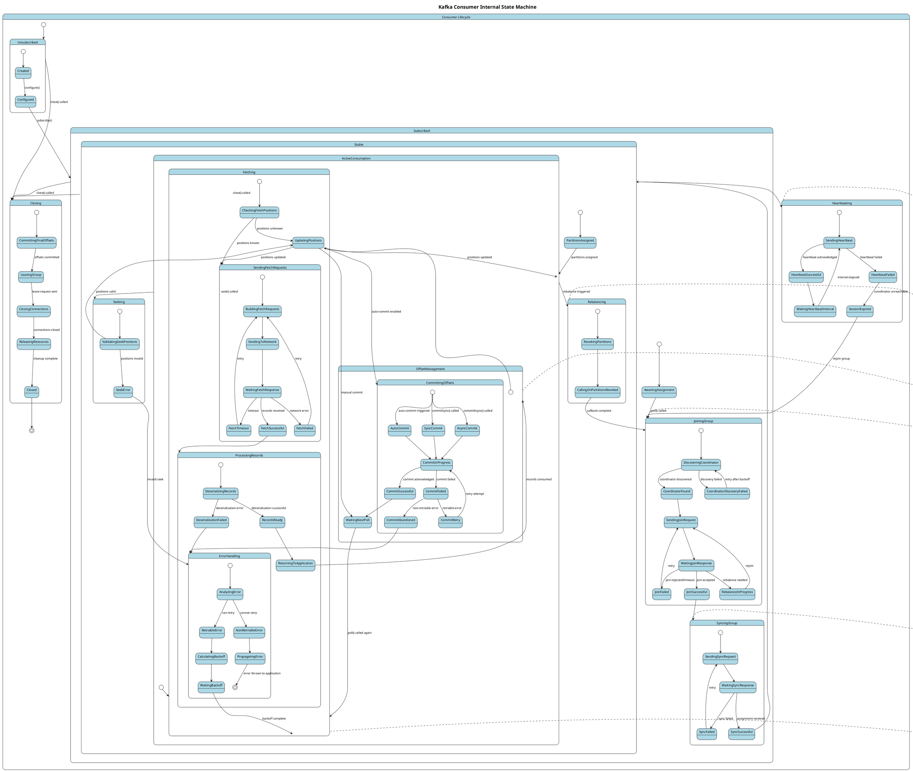

# Apache Kafka Consumer Internal Design Analysis

## Table of Contents
1. [Consumer Source Code Review](#consumer-source-code-review)
2. [Consumer Test Analysis](#consumer-test-analysis)
3. [Internal Architecture Components](#internal-architecture-components)
4. [Detailed State Machine Analysis](#detailed-state-machine-analysis)
5. [PlantUML State Machine Diagram](#plantuml-state-machine-diagram)

## Consumer Source Code Review

### Overview
The Apache Kafka consumer source code at `https://github.com/jabrena/kafka/tree/21ab4d2c6d821c7d90f4ead06d2f9e461654cd0e/clients/src/main/java/org/apache/kafka/clients/consumer` contains the core implementation of the Kafka consumer client.

### Key Source Files and Components

#### 1. KafkaConsumer.java
- **Main consumer API class**
- Thread-safe consumer implementation
- Manages subscription, polling, and offset operations
- Coordinates with internal components

#### 2. ConsumerCoordinator.java
- **Group membership management**
- Handles consumer group join/leave operations
- Manages partition assignments and rebalancing
- Communicates with group coordinator broker

#### 3. Fetcher.java
- **Record fetching logic**
- Sends fetch requests to brokers
- Handles response processing and record extraction
- Manages fetch positions and offsets

#### 4. SubscriptionState.java
- **Subscription and assignment tracking**
- Maintains current topic subscriptions
- Tracks partition assignments and positions
- Manages offset positions and committed offsets

#### 5. ConsumerNetworkClient.java
- **Network communication layer**
- Extends NetworkClient for consumer-specific operations
- Handles request/response lifecycle
- Manages broker connections

#### 6. AbstractCoordinator.java
- **Base coordinator functionality**
- Implements group protocol operations
- Handles heartbeats and session management
- Manages coordinator discovery and failover

#### 7. ConsumerRebalanceListener.java
- **Rebalancing callback interface**
- onPartitionsRevoked() - called before rebalancing
- onPartitionsAssigned() - called after partition assignment
- Allows custom logic during rebalancing events

#### 8. OffsetCommitCallback.java
- **Asynchronous offset commit callback**
- Handles completion of offset commit operations
- Provides error handling for commit failures

## Consumer Test Analysis

### Test Structure and Patterns

#### Unit Tests
- **MockConsumer Usage**: Simulates consumer behavior without broker dependency
- **Component Isolation**: Tests individual components like Fetcher, Coordinator
- **State Validation**: Verifies internal state transitions and consistency

#### Integration Tests
- **End-to-End Scenarios**: Full consumer lifecycle testing
- **Error Simulation**: Network failures, broker unavailability
- **Performance Testing**: Throughput and latency measurements

#### Key Test Categories

1. **Subscription and Assignment Tests**
   ```java
   // Example test pattern
   MockConsumer<String, String> consumer = new MockConsumer<>(OffsetResetStrategy.EARLIEST);
   consumer.subscribe(Arrays.asList("test-topic"));
   consumer.rebalance(Arrays.asList(new TopicPartition("test-topic", 0)));
   ```

2. **Offset Management Tests**
   - Automatic vs manual offset commits
   - Offset reset strategies (earliest, latest, none)
   - Offset commit callback handling

3. **Rebalancing Tests**
   - Consumer group join/leave scenarios
   - Partition reassignment validation
   - Rebalance listener callback testing

4. **Error Handling Tests**
   - Broker disconnection scenarios
   - Deserialization error handling
   - Timeout and retry logic validation

## Internal Architecture Components

### Core Component Interactions

```
KafkaConsumer
    ├── ConsumerCoordinator (group management)
    ├── Fetcher (record fetching)
    ├── SubscriptionState (subscription tracking)
    ├── ConsumerNetworkClient (network I/O)
    ├── ConsumerMetadata (topic metadata)
    └── OffsetFetcher (offset management)
```

### Component Responsibilities

#### ConsumerCoordinator
- **Group Protocol**: Implements consumer group protocol
- **Rebalancing**: Coordinates partition rebalancing
- **Heartbeats**: Maintains session with group coordinator
- **Assignment Strategy**: Executes partition assignment strategies

#### Fetcher
- **Fetch Requests**: Builds and sends fetch requests
- **Response Processing**: Parses fetch responses
- **Record Extraction**: Converts response data to ConsumerRecords
- **Position Management**: Tracks fetch positions per partition

#### SubscriptionState
- **Topic Subscription**: Manages subscribed topics and patterns
- **Partition Assignment**: Tracks assigned partitions
- **Offset Positions**: Maintains current and committed positions
- **Assignment Validation**: Ensures assignment consistency

#### ConsumerNetworkClient
- **Connection Management**: Handles broker connections
- **Request Scheduling**: Schedules and sends requests
- **Response Handling**: Processes responses and callbacks
- **Metadata Updates**: Triggers metadata refreshes

### Threading Model

#### Single-Threaded Design
- **Main Thread**: All consumer operations in single thread
- **No Background Threads**: Unlike producer, no separate I/O threads
- **Synchronous Operations**: poll() drives all network I/O

#### Implications
- **Thread Safety**: Consumer is NOT thread-safe
- **Blocking Operations**: Long polls can block application
- **Resource Management**: Simpler resource management

## Detailed State Machine Analysis

### Consumer Lifecycle States

#### 1. Initialization States
- **UNSUBSCRIBED**: Consumer created but no subscriptions
- **SUBSCRIBED**: Topics subscribed, awaiting assignment
- **REBALANCING**: Participating in rebalancing process

#### 2. Active States  
- **STABLE**: Partitions assigned, actively consuming
- **FETCHING**: Sending fetch requests to brokers
- **PROCESSING**: Processing fetched records

#### 3. Coordination States
- **JOINING_GROUP**: Attempting to join consumer group
- **SYNCING_GROUP**: Synchronizing group state and assignments
- **HEARTBEATING**: Sending periodic heartbeats

#### 4. Offset Management States
- **COMMITTING_SYNC**: Synchronous offset commit in progress
- **COMMITTING_ASYNC**: Asynchronous offset commit in progress
- **SEEKING**: Seeking to specific offset positions

#### 5. Error and Recovery States
- **COORDINATOR_UNKNOWN**: Group coordinator not found
- **REBALANCE_IN_PROGRESS**: Rebalancing triggered by coordinator
- **AUTHORIZATION_FAILED**: Authentication/authorization errors
- **OFFSET_OUT_OF_RANGE**: Requested offset not available

#### 6. Shutdown States
- **CLOSING**: Consumer shutdown initiated
- **CLOSED**: Consumer fully closed and cleaned up

### State Transition Triggers

#### External Triggers
- **subscribe()**: UNSUBSCRIBED → SUBSCRIBED
- **poll()**: Drives most state transitions
- **commitSync()/commitAsync()**: → COMMITTING states
- **seek()**: → SEEKING state
- **close()**: → CLOSING → CLOSED

#### Internal Triggers
- **Coordinator Response**: Group state changes
- **Rebalance Detection**: → REBALANCING
- **Heartbeat Failure**: → COORDINATOR_UNKNOWN
- **Assignment Change**: → REBALANCING

#### Timer-Based Triggers
- **Session Timeout**: Triggers rebalancing
- **Heartbeat Interval**: Sends periodic heartbeats
- **Request Timeout**: Triggers retry logic

### Error Handling Patterns

#### Retriable Errors
- **Network Timeouts**: Retry with backoff
- **Coordinator Not Available**: Rediscover coordinator
- **Not Coordinator**: Find new coordinator

#### Non-Retriable Errors
- **Authorization Failed**: Propagate to application
- **Unknown Topic**: Immediate failure
- **Invalid Group ID**: Configuration error

#### Recovery Strategies
- **Exponential Backoff**: For transient failures
- **Coordinator Rediscovery**: For coordinator failures
- **Metadata Refresh**: For topic/partition changes

## PlantUML State Machine Diagram

### Comprehensive Consumer State Machine

The following diagram represents the complete state machine for the Kafka Consumer, including all major states, sub-states, and transitions:



### State Machine Key Features

#### Hierarchical States
- **Nested State Structure**: Major states contain detailed sub-states
- **State Inheritance**: Sub-states inherit behavior from parent states
- **Parallel States**: Some operations happen concurrently

#### Error Recovery Patterns
- **Retry Logic**: Built-in retry mechanisms with backoff
- **State Restoration**: Ability to recover from failures
- **Graceful Degradation**: Fallback behaviors for edge cases

#### Transition Conditions
- **Method Calls**: External API calls trigger transitions
- **Network Events**: Responses and timeouts drive state changes
- **Timer Events**: Heartbeat intervals and session timeouts
- **Error Conditions**: Various error types trigger different paths

#### Configuration Impact
- **Auto-commit**: Affects offset management state transitions
- **Session Timeout**: Controls heartbeat failure detection
- **Retry Settings**: Influences error recovery behavior
- **Rebalance Strategy**: Affects partition assignment process

This comprehensive state machine provides a complete view of the Kafka Consumer's internal operation, showing how it manages group membership, partition assignments, record fetching, offset management, and error recovery in a coordinated manner.