# Apache Kafka Client Tests and Producer Internal Design Analysis

## Table of Contents
1. [Apache Kafka Client Tests Review](#apache-kafka-client-tests-review)
2. [Kafka Producer Internal Design Analysis](#kafka-producer-internal-design-analysis)
3. [PlantUML State Machine Diagram](#plantuml-state-machine-diagram)

## Apache Kafka Client Tests Review

### Overview
The Apache Kafka client tests are located at `https://github.com/apache/kafka/tree/trunk/clients/src/test/java/org/apache/kafka/clients` and provide comprehensive examples of how to use the Kafka client APIs effectively.

### Key Test Categories

#### 1. Producer Tests
- **MockProducer Tests**: Demonstrate how to test producer logic without a running Kafka cluster
- **Integration Tests**: Show real producer interactions with Kafka brokers
- **Serialization Tests**: Validate custom serializers and deserializers
- **Partitioning Tests**: Test custom partitioning strategies

#### 2. Consumer Tests
- **MockConsumer Tests**: Enable testing of consumer logic in isolation
- **Group Management Tests**: Validate consumer group coordination
- **Offset Management Tests**: Test offset commit and reset functionality
- **Rebalancing Tests**: Verify consumer rebalancing behavior

#### 3. Common Client Tests
- **Network Client Tests**: Test low-level network communication
- **Metadata Tests**: Validate cluster metadata handling
- **Authentication Tests**: Test security configurations
- **Error Handling Tests**: Validate retry logic and error scenarios

### How to Use the Tests

#### Setting Up Test Environment
```java
// Example of using MockProducer for unit testing
MockProducer<String, String> mockProducer = new MockProducer<>(
    true, // autoComplete
    new StringSerializer(), 
    new StringSerializer()
);

// Your producer wrapper class
YourProducerService service = new YourProducerService(mockProducer);

// Send messages
service.sendMessage("test-topic", "key1", "value1");

// Verify sent records
List<ProducerRecord<String, String>> history = mockProducer.history();
assertEquals(1, history.size());
assertEquals("test-topic", history.get(0).topic());
```

#### Running Integration Tests
```bash
# Clone the repository
git clone https://github.com/apache/kafka.git
cd kafka

# Run all client tests
./gradlew clients:test

# Run specific test class
./gradlew clients:test --tests "*ProducerTest*"
```

### Best Practices from Tests

1. **Use Mock Clients for Unit Tests**: Avoid dependencies on running Kafka clusters
2. **Test Error Scenarios**: Validate retry logic and failure handling
3. **Validate Serialization**: Ensure custom serializers work correctly
4. **Test Configuration**: Verify different producer/consumer configurations
5. **Performance Testing**: Use load tests to validate throughput and latency

## Kafka Producer Internal Design Analysis

### Core Components

#### 1. KafkaProducer
- Main entry point for sending messages
- Thread-safe and manages internal resources
- Handles configuration and initialization

#### 2. Serializer
- Converts key and value objects to byte arrays
- Built-in serializers: StringSerializer, ByteArraySerializer, IntegerSerializer
- Custom serializers can be implemented

#### 3. Partitioner
- Determines target partition for each record
- **DefaultPartitioner**: Hash-based partitioning with key, round-robin without key
- **RoundRobinPartitioner**: Even distribution across all partitions
- **UniformStickyPartitioner**: Batch-aware partitioning for better performance

#### 4. RecordAccumulator
- Buffers records in memory before sending
- Organizes records into batches per partition
- Manages memory allocation and deallocation
- Handles compression and batching logic

#### 5. Sender Thread
- Background I/O thread for network communication
- Retrieves batches from RecordAccumulator
- Manages connections to Kafka brokers
- Handles acknowledgments and retries

#### 6. NetworkClient
- Low-level network communication layer
- Manages TCP connections to brokers
- Handles request/response protocol
- Implements connection pooling and load balancing

### Message Flow Architecture

```
ProducerRecord → Serialization → Partitioning → RecordAccumulator → Sender → NetworkClient → Broker
     ↓              ↓              ↓               ↓            ↓         ↓         ↓
   Created     Key/Value      Partition      Batched &     Sent via   TCP      Persisted
              Serialized     Determined     Compressed    Background  Request   to Log
                                                         Thread
```

### Key Design Patterns

#### 1. Producer-Consumer Pattern
- RecordAccumulator acts as buffer between producer and sender threads
- Decouples message creation from network I/O

#### 2. Batch Processing
- Records are batched to improve throughput
- Configurable batch size and linger time

#### 3. Asynchronous Processing
- Non-blocking send() method returns Future
- Callback mechanism for handling results

#### 4. Retry Mechanism
- Configurable retry count and backoff
- Different retry strategies for different error types

#### 5. Memory Management
- Bounded memory usage with configurable buffer size
- Blocks when buffer is full (configurable behavior)

### Configuration Parameters

#### Performance Tuning
- `batch.size`: Maximum batch size in bytes
- `linger.ms`: Time to wait for additional records
- `buffer.memory`: Total memory for buffering
- `compression.type`: Compression algorithm (none, gzip, snappy, lz4, zstd)

#### Reliability
- `acks`: Number of acknowledgments required (0, 1, all)
- `retries`: Maximum number of retry attempts
- `delivery.timeout.ms`: Maximum time for delivery
- `enable.idempotence`: Exactly-once semantics

#### Networking
- `max.in.flight.requests.per.connection`: Concurrent requests per connection
- `request.timeout.ms`: Request timeout
- `connections.max.idle.ms`: Connection idle timeout

## PlantUML State Machine Diagram

### Detailed Producer State Machine

The following PlantUML diagram represents the comprehensive state machine for the Kafka Producer internal workflow:

```plantuml
@startuml KafkaProducerStateMachine
!define RECTANGLE class

state "Producer Lifecycle" as ProducerLifecycle {
    [*] --> Initializing
    
    state Initializing {
        [*] --> LoadingConfig
        LoadingConfig --> ValidatingConfig
        ValidatingConfig --> InitializingComponents
        InitializingComponents --> StartingSenderThread
        StartingSenderThread --> Ready
    }
    
    Ready --> Processing : send() called
    
    state Processing {
        [*] --> Serializing
        
        state Serializing {
            [*] --> SerializingKey
            SerializingKey --> SerializingValue
            SerializingValue --> SerializationComplete
        }
        
        SerializationComplete --> Partitioning
        
        state Partitioning {
            [*] --> CheckingPartitionOverride
            CheckingPartitionOverride --> CalculatingPartition : no override
            CheckingPartitionOverride --> UsingProvidedPartition : partition specified
            CalculatingPartition --> PartitionDetermined
            UsingProvidedPartition --> PartitionDetermined
        }
        
        PartitionDetermined --> Accumulating
        
        state Accumulating {
            [*] --> CheckingBufferSpace
            CheckingBufferSpace --> WaitingForSpace : buffer full
            CheckingBufferSpace --> AddingToBuffer : space available
            WaitingForSpace --> AddingToBuffer : space freed
            AddingToBuffer --> CheckingBatchReady
            CheckingBatchReady --> BatchReady : batch size/linger time reached
            CheckingBatchReady --> WaitingInBuffer : batch not ready
            WaitingInBuffer --> BatchReady : timeout or size threshold
        }
        
        BatchReady --> Sending
    }
    
    state Sending {
        [*] --> PreparingSend
        PreparingSend --> SendingToNetwork
        
        state SendingToNetwork {
            [*] --> EstablishingConnection
            EstablishingConnection --> ConnectionFailed : network error
            EstablishingConnection --> ConnectionEstablished : success
            ConnectionEstablished --> TransmittingData
            TransmittingData --> WaitingForAcknowledgment
        }
        
        WaitingForAcknowledgment --> AcknowledgmentReceived : success
        WaitingForAcknowledgment --> NetworkTimeout : timeout
        WaitingForAcknowledgment --> NetworkError : error response
        
        ConnectionFailed --> RetryLogic
        NetworkTimeout --> RetryLogic
        NetworkError --> RetryLogic
        
        state RetryLogic {
            [*] --> CheckingRetryCount
            CheckingRetryCount --> CalculatingBackoff : retries available
            CheckingRetryCount --> PermanentFailure : max retries exceeded
            CalculatingBackoff --> WaitingForRetry
            WaitingForRetry --> PreparingSend : backoff complete
        }
        
        AcknowledgmentReceived --> Success
        PermanentFailure --> Failed
    }
    
    Success --> Ready : continue processing
    Failed --> Ready : continue processing (callback notified)
    
    Ready --> Closing : close() called
    
    state Closing {
        [*] --> FlushingPendingRecords
        FlushingPendingRecords --> StoppingSenderThread
        StoppingSenderThread --> ClosingConnections
        ClosingConnections --> ReleasingResources
        ReleasingResources --> Closed
    }
    
    Closed --> [*]
}

note right of Serializing
    Key and Value serialization
    happens in parallel where
    possible for performance
end note

note right of Accumulating
    RecordAccumulator manages
    batching per partition with
    configurable batch size
    and linger time
end note

note right of SendingToNetwork
    Sender thread handles
    multiple batches concurrently
    with flow control
end note

note right of RetryLogic
    Exponential backoff with
    jitter to avoid thundering
    herd problems
end note

@enduml
```



### State Descriptions

#### Initialization States
- **LoadingConfig**: Reading producer configuration properties
- **ValidatingConfig**: Ensuring configuration is valid and complete
- **InitializingComponents**: Creating serializers, partitioner, accumulator, etc.
- **StartingSenderThread**: Starting the background I/O thread

#### Processing States
- **SerializingKey/Value**: Converting objects to byte arrays
- **Partitioning**: Determining target partition using partitioner logic
- **Accumulating**: Adding record to appropriate batch in RecordAccumulator
- **BatchReady**: Batch meets size or time threshold for sending

#### Sending States
- **EstablishingConnection**: Creating TCP connection to target broker
- **TransmittingData**: Sending batch data over network
- **WaitingForAcknowledgment**: Waiting for broker response
- **RetryLogic**: Handling failures with exponential backoff

#### Terminal States
- **Success**: Record successfully delivered and acknowledged
- **Failed**: Record failed after exhausting retries
- **Closed**: Producer has been shut down cleanly

### Key State Transitions

1. **Happy Path**: Initializing → Ready → Processing → Sending → Success → Ready
2. **Retry Path**: Sending → RetryLogic → Sending (with backoff)
3. **Failure Path**: RetryLogic → Failed → Ready (callback notified)
4. **Shutdown Path**: Ready → Closing → Closed

This state machine provides a comprehensive view of the Kafka Producer's internal workflow, showing how records flow through the system and how various error conditions are handled.